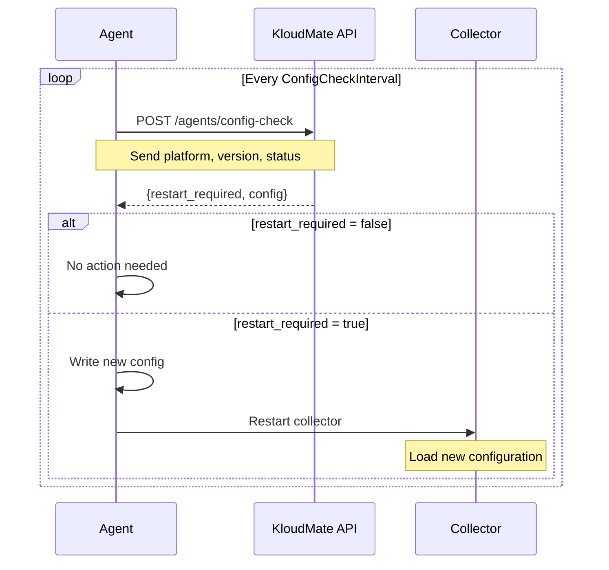

## Overview

KloudMate Agent uses a dual-configuration approach to separate agent management from OpenTelemetry Collector configuration. This design enables remote configuration updates, platform-specific optimizations, and seamless configuration management.

## Configuration Architecture

<CardGroup cols={2}>
  <Card title="Agent Configuration" icon="gear" href="#agent-configuration-file">
    Controls agent behavior, authentication, and update mechanisms
  </Card>
  <Card title="Collector Configuration" icon="database" href="#collector-configuration-file">
    Defines OpenTelemetry pipelines, receivers, processors, and exporters
  </Card>
</CardGroup>

## Configuration Hierarchy

The agent loads configuration from multiple sources in the following priority order:

<Steps>
  <Step title="Command-line Flags">
    Highest priority - overrides all other configuration sources
    ```bash
    kmagent start --api-key=<key> --collector-endpoint=<url>
    ```
  </Step>
  
  <Step title="Environment Variables">
    Second priority - useful for containerized deployments
    ```bash
    export KM_API_KEY=<key>
    export KM_COLLECTOR_ENDPOINT=<url>
    ```
  </Step>
  
  <Step title="Agent Configuration File">
    Third priority - persistent configuration storage
    ```yaml
    # /etc/kmagent/agent-config.yaml
    key: ${KM_API_KEY}
    endpoint: https://otel.kloudmate.com:4318
    interval: 10s
    ```
  </Step>
  
  <Step title="Remote Configuration">
    Lowest priority - fetched from KloudMate API for dynamic updates
  </Step>
</Steps>

## File Locations

### Agent Configuration File

The agent configuration file location varies by deployment mode:

<CodeGroup>
```bash Linux/Unix
/etc/kmagent/config.yaml
```

```bash macOS
/Library/Application Support/kmagent/config.yaml
```

```bash Windows
# Same directory as kmagent.exe
.\config.yaml
```

```bash Docker
/etc/kmagent/config.yaml
```

```bash Kubernetes
# Loaded from ConfigMap
km-agent-config
```
</CodeGroup>

<Note>
  The agent automatically creates the configuration directory if it doesn't exist (file permissions: `0755`).
</Note>

### Collector Configuration File

The OpenTelemetry Collector configuration is platform-specific:

<Tabs>
  <Tab title="Host Mode">
    Default path: `/etc/kmagent/config.yaml`
    
    Uses `host-col-config.yaml` template with:
    - Host metrics collection (CPU, memory, disk, network)
    - OTLP receiver for application telemetry
    - Resource detection and enrichment
  </Tab>
  
  <Tab title="Docker Mode">
    Default path: `/etc/kmagent/config.yaml`
    
    Uses `docker-col-config.yaml` template with:
    - Docker container metrics via `docker_stats` receiver
    - File log collection from `/var/log` and Docker containers
    - Host filesystem mounted at `/hostfs`
  </Tab>
  
  <Tab title="Kubernetes DaemonSet">
    Loaded from ConfigMap: `km-daemonset-config`
    
    Uses `daemonset-col-config.yaml` template with:
    - Node-level host metrics
    - Kubelet stats for pod/container metrics
    - Container log collection via `filelog` receiver
    - Kubernetes attributes processor
  </Tab>
</Tabs>

## Configuration File Formats

### Agent Configuration (YAML)

The agent configuration file uses a simplified YAML format:

```yaml ~/workspace/source/configs/agent-config.yaml
# This config file will be used by the KM-Agent on it's first initialization.

key: ${KM_API_KEY}
debug: basic
endpoint: https://otel.kloudmate.com:4318
interval: 10s
```

<ParamField path="key" type="string" required>
  API key for authentication with KloudMate backend. Supports environment variable expansion.
</ParamField>

<ParamField path="endpoint" type="string" required>
  OpenTelemetry collector endpoint URL (HTTP/S).
</ParamField>

<ParamField path="interval" type="duration" default="60s">
  Configuration check interval for remote updates.
</ParamField>

<ParamField path="debug" type="string" default="none">
  Debug exporter verbosity level: `none`, `basic`, `normal`, `detailed`.
</ParamField>

### Collector Configuration (YAML)

The collector configuration follows the standard OpenTelemetry Collector format:

```yaml Structure
receivers:
  # Data ingestion components
  hostmetrics:
    collection_interval: 60s
  otlp:
    protocols:
      grpc:
      http:

processors:
  # Data transformation pipeline
  batch:
    send_batch_size: 10000
  resourcedetection:
    detectors: [system, env]

exporters:
  # Data export destinations
  otlphttp:
    endpoint: ${env:KM_COLLECTOR_ENDPOINT}
    headers:
      Authorization: ${env:KM_API_KEY}

service:
  pipelines:
    metrics:
      receivers: [hostmetrics, otlp]
      processors: [resourcedetection, batch]
      exporters: [otlphttp]
```

<Note>
  All collector configurations use environment variable substitution for sensitive values like `${env:KM_API_KEY}`.
</Note>

## Configuration Loading Process

The agent follows this initialization sequence:

<Steps>
  <Step title="Parse CLI Arguments">
    Extract flags and determine configuration file path from `--agent-config` or `KM_AGENT_CONFIG` environment variable.
    
    See implementation in `~/workspace/source/cmd/kmagent/main.go:179-230`
  </Step>
  
  <Step title="Load Agent Config">
    Read agent configuration file (if exists) and merge with CLI flags and environment variables.
    
    See implementation in `~/workspace/source/internal/config/config.go:73-117`
  </Step>
  
  <Step title="Determine Collector Config Path">
    Resolve platform-specific collector configuration path based on OS and deployment mode.
    
    ```go
    func GetDefaultConfigPath() string {
        if runtime.GOOS == "windows" {
            execPath, _ := os.Executable()
            return filepath.Join(filepath.Dir(execPath), "config.yaml")
        } else if runtime.GOOS == "darwin" {
            return "/Library/Application Support/kmagent/config.yaml"
        } else {
            return "/etc/kmagent/config.yaml"
        }
    }
    ```
  </Step>
  
  <Step title="Load Collector Config">
    Read OpenTelemetry Collector configuration YAML and parse into internal structure.
  </Step>
  
  <Step title="Validate Configuration">
    Ensure all required fields are present and values are valid before starting the collector.
  </Step>
  
  <Step title="Start Remote Config Updates">
    Initialize background goroutine to check for configuration updates from KloudMate API.
  </Step>
</Steps>

## Environment Variable Substitution

Both configuration files support environment variable expansion:

<CodeGroup>
```yaml Shell-style
endpoint: ${KM_COLLECTOR_ENDPOINT}
api_key: ${KM_API_KEY}
```

```yaml With Defaults
endpoint: ${KM_COLLECTOR_ENDPOINT:-https://otel.kloudmate.com:4318}
```

```yaml Env Prefix
endpoint: ${env:KM_COLLECTOR_ENDPOINT}
```
</CodeGroup>

<Warning>
  Environment variables are resolved at runtime. Missing required variables will cause the agent to fail startup.
</Warning>

## Configuration Validation

The agent performs validation during startup:

<AccordionGroup>
  <Accordion title="Required Fields Validation">
    Ensures critical configuration fields are present:
    - `ExporterEndpoint`: Must be a valid HTTP/HTTPS URL
    - `APIKey`: Must be non-empty for authenticated endpoints
    - `OtelConfigPath`: Must be readable if specified
  </Accordion>
  
  <Accordion title="Path Validation">
    Verifies configuration file paths:
    - Configuration directory must be writable
    - Collector config file must exist and be valid YAML
    - Parent directories are created automatically with `0755` permissions
  </Accordion>
  
  <Accordion title="URL Validation">
    Validates endpoint URLs:
    - Exporter endpoint must use HTTP or HTTPS scheme
    - Update endpoint is derived from exporter endpoint if not explicitly set
    - Hostname extraction follows pattern: `otel.kloudmate.dev` → `api.kloudmate.dev`
    
    See implementation in `~/workspace/source/internal/config/config.go:28-52`
  </Accordion>
  
  <Accordion title="Collector Config Validation">
    OpenTelemetry Collector validates:
    - All referenced components are registered
    - Pipeline connections are valid
    - Processor configurations are correct
    - Exporter endpoints are reachable
  </Accordion>
</AccordionGroup>

## Configuration Update Mechanism

The agent supports dynamic configuration updates without restart:



Configuration updates are atomic operations using file rename to prevent corruption.

See implementation in `~/workspace/source/internal/updater/updater.go:123-159`

## Next Steps

<CardGroup cols={2}>
  <Card title="Agent Configuration" icon="gear" href="/api/agent-config">
    Detailed agent configuration reference
  </Card>
  <Card title="Collector Configuration" icon="database" href="/api/collector-config">
    OpenTelemetry Collector configuration guide
  </Card>
</CardGroup>