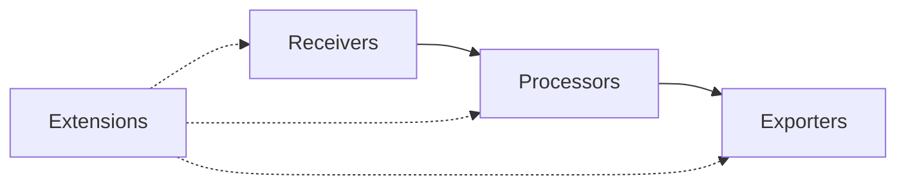

The KloudMate Agent is built on the OpenTelemetry Collector framework, which uses a modular architecture composed of four main component types: receivers, processors, exporters, and extensions.

## Component Architecture

The collector processes telemetry data through a pipeline architecture:



<CardGroup cols={2}>
  <Card title="Receivers" icon="download" href="/components/receivers">
    Collect telemetry data from various sources including hosts, databases, cloud platforms, and applications
  </Card>
  <Card title="Processors" icon="gear" href="/components/processors">
    Transform, filter, enrich, and manipulate telemetry data as it flows through pipelines
  </Card>
  <Card title="Exporters" icon="upload" href="/components/exporters">
    Send processed telemetry data to backends like KloudMate or other observability platforms
  </Card>
  <Card title="Extensions" icon="puzzle-piece" href="/components/extensions">
    Add capabilities like health checks, storage, and diagnostics without direct data access
  </Card>
</CardGroup>

## Pipeline Configuration

Components are organized into pipelines in the collector configuration. Each pipeline processes a specific telemetry type (metrics, logs, or traces).

### Example Pipeline Structure

```yaml
service:
  pipelines:
    metrics:
      receivers: [otlp, hostmetrics]
      processors: [resourcedetection, batch]
      exporters: [otlphttp]
    logs:
      receivers: [otlp, filelog]
      processors: [resource, batch]
      exporters: [otlphttp]
    traces:
      receivers: [otlp]
      processors: [batch]
      exporters: [otlphttp]
```

## Component Categories

### Receivers

KloudMate Agent includes receivers for:

- **Infrastructure**: Host metrics, Docker, Kubernetes
- **Databases**: MySQL, PostgreSQL, MongoDB, Redis, Oracle, SQL Server, SAP HANA, Elasticsearch
- **Web Servers**: Apache, Nginx, IIS
- **Message Queues**: RabbitMQ, Kafka
- **Cloud Platforms**: AWS CloudWatch, Azure Monitor, Google Cloud Monitoring
- **Logs**: File logs, journald, syslog, Fluent Forward
- **Network**: Netflow, SNMP
- **Custom**: Prometheus metrics, HTTP checks, SQL queries

### Processors

Processors handle data transformation and enrichment:

- **Essential**: Batch, Memory Limiter
- **Resource & Attributes**: Resource Detection, K8s Attributes, Attributes
- **Transformation**: Transform (OTTL), Metrics Transform, Cumulative to Delta, Delta to Rate
- **Filtering**: Filter, Probabilistic Sampler, Redaction
- **Organization**: Group by Attributes, Group by Trace

### Exporters

KloudMate Agent supports these exporters:

- **OTLP**: Standard protocol for sending to KloudMate and other OTLP-compatible backends
- **OTLP HTTP**: HTTP-based OTLP protocol variant
- **Debug**: Console output for troubleshooting
- **Nop**: No-operation for testing

### Extensions

Extensions provide supporting functionality:

- **Health Check**: Kubernetes liveness and readiness probes
- **File Storage**: Persistent state across restarts
- **Z-Pages**: In-process diagnostics
- **Memory Limiter**: Memory usage control

## Platform-Specific Components

The KloudMate Agent includes platform-specific components that are only available on certain operating systems or deployment modes.

### Linux-Specific

- **Docker Stats Receiver**: Container metrics from Docker daemon
- **Journald Receiver**: Systemd journal logs

### Windows-Specific

- **Windows Event Log Receiver**: Windows event logs
- **Windows Performance Counters Receiver**: Performance counter metrics
- **IIS Receiver**: Microsoft IIS web server metrics
- **Windows Service Receiver**: Windows service status monitoring
- **SQL Server Receiver**: Microsoft SQL Server metrics

### Kubernetes-Specific

- **K8s Cluster Receiver**: Cluster-level metrics
- **K8s Objects Receiver**: Kubernetes object events as logs
- **K8s Events Receiver**: Cluster events
- **Kubelet Stats Receiver**: Pod and container metrics
- **K8s Attributes Processor**: Kubernetes metadata enrichment

## Configuration Best Practices

<Steps>
  <Step title="Start with essential components">
    Begin with OTLP receiver, batch processor, and OTLP HTTP exporter for basic functionality
  </Step>
  
  <Step title="Add monitoring receivers">
    Enable host metrics and application-specific receivers based on your infrastructure
  </Step>
  
  <Step title="Configure processors">
    Add resource detection and attributes processors to enrich telemetry with context
  </Step>
  
  <Step title="Optimize performance">
    Tune batch sizes, memory limits, and collection intervals for your workload
  </Step>
  
  <Step title="Enable extensions">
    Configure health checks for production deployments and Z-pages for debugging
  </Step>
</Steps>

## Component Lifecycle

<Note>
Components are initialized when the collector starts and shut down gracefully when the collector stops. Failed components can cause the entire collector to fail, so ensure proper configuration and testing.
</Note>

### Initialization Order

1. **Extensions** are initialized first
2. **Receivers** start collecting data
3. **Processors** begin processing data from receivers
4. **Exporters** connect to backends and start sending data

### Shutdown Order

Shutdown occurs in reverse order to prevent data loss:

1. **Receivers** stop accepting new data
2. **Processors** finish processing queued data
3. **Exporters** flush remaining data to backends
4. **Extensions** shut down last

## Remote Configuration

KloudMate Agent supports remote configuration, allowing you to manage component configurations centrally without restarting agents. See the [Remote Configuration](/configuration/remote-config) guide for details.

<Warning>
Changing component configurations requires careful testing. Invalid configurations can cause the collector to fail to start or drop telemetry data.
</Warning>

## Next Steps

<CardGroup cols={2}>
  <Card title="Explore Receivers" icon="download" href="/components/receivers">
    Learn about available receivers and their configuration options
  </Card>
  <Card title="Configure Processors" icon="gear" href="/components/processors">
    Understand how to transform and enrich your telemetry data
  </Card>
  <Card title="Setup Exporters" icon="upload" href="/components/exporters">
    Configure exporters to send data to KloudMate or other backends
  </Card>
  <Card title="Add Extensions" icon="puzzle-piece" href="/components/extensions">
    Enable supporting capabilities like health checks and diagnostics
  </Card>
</CardGroup>