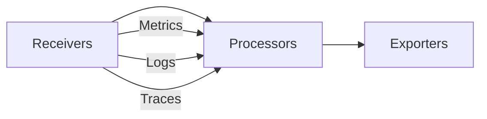

The KloudMate Agent is built on the OpenTelemetry Collector and supports a rich set of receivers, processors, and exporters. This guide covers the default configurations and customization options.

## Pipeline Architecture

The collector uses a pipeline architecture where telemetry data flows through three stages:



<CardGroup cols={3}>
  <Card title="Receivers" icon="download">
    Collect telemetry from various sources
  </Card>
  <Card title="Processors" icon="gear">
    Transform, filter, and enrich data
  </Card>
  <Card title="Exporters" icon="upload">
    Send data to backends
  </Card>
</CardGroup>

## Default Configurations

The agent includes three optimized configurations based on deployment mode:

### Host Configuration

For bare metal and VM deployments (`host-col-config.yaml`):

<CodeGroup>
```yaml Receivers
receivers:
  hostmetrics:
    collection_interval: 60s
    scrapers:
      cpu:
        metrics:
          system.cpu.utilization:
            enabled: true
      load:
        cpu_average: true
      memory:
        metrics:
          system.memory.utilization:
            enabled: true
      filesystem:
        metrics:
          system.filesystem.usage:
            enabled: true
          system.filesystem.utilization:
            enabled: true
      disk: {}
      network: {}
  
  otlp:
    protocols:
      grpc:
        endpoint: 0.0.0.0:4317
      http:
        endpoint: 0.0.0.0:4318
```

```yaml Processors
processors:
  batch:
    send_batch_size: 10000
    timeout: 10s
  
  resourcedetection:
    detectors: [system]
    system:
      resource_attributes:
        host.name:
          enabled: true
        host.id:
          enabled: true
  
  resource:
    attributes:
      - key: service.name
        action: insert
        from_attribute: host.name
  
  cumulativetodelta:
    include:
      match_type: strict
      metrics:
        - system.network.io
        - system.disk.io
        - system.disk.operations.rate
        - system.network.packets.rate
  
  deltatorate:
    metrics:
      - system.network.io
      - system.disk.io
```

```yaml Exporters
exporters:
  debug:
    verbosity: basic
  
  otlphttp:
    sending_queue:
      enabled: true
      num_consumers: 10
      queue_size: 10000
    endpoint: ${env:KM_COLLECTOR_ENDPOINT}
    headers:
      Authorization: ${env:KM_API_KEY}
```

```yaml Service Pipelines
service:
  telemetry:
    metrics:
      level: none
  pipelines:
    metrics:
      receivers: [otlp, hostmetrics]
      processors:
        - resourcedetection
        - resource
        - cumulativetodelta
        - deltatorate
        - transform/ratecalculation/sumtogauge
        - transform/ratecalculation/copymetric
        - batch
      exporters: [debug, otlphttp]
    
    logs:
      receivers: [otlp]
      processors: [resourcedetection, resource, batch]
      exporters: [debug, otlphttp]
    
    traces:
      receivers: [otlp]
      processors: [resourcedetection, resource, batch]
      exporters: [debug, otlphttp]
```
</CodeGroup>

### Docker Configuration

For Docker deployments (`docker-col-config.yaml`):

<CodeGroup>
```yaml Docker-Specific Receivers
receivers:
  docker_stats:
    endpoint: "unix:///var/run/docker.sock"
    collection_interval: 60s
    timeout: 10s
  
  filelog:
    include:
      - /var/log/**/*.log
      - /var/lib/docker/containers/**/*.log*
      - ${env:FILELOG_PATHS}
    exclude:
      - /var/log/kmagent*/**/*.log
      - '**/*.gz'
      - '**/*.zip'
      - '**/*.tar'
    include_file_name_resolved: true
    include_file_path: true
    max_log_size: "1MiB"
  
  hostmetrics:
    collection_interval: 60s
    root_path: /hostfs
    scrapers:
      cpu:
        metrics:
          system.cpu.utilization:
            enabled: true
      memory:
        metrics:
          system.memory.utilization:
            enabled: true
      disk:
      network:
      filesystem:
        exclude_fs_types:
          fs_types:
            - autofs
            - overlay
            - tmpfs
            - devtmpfs
          match_type: strict
```

```yaml Docker Processors
processors:
  resourcedetection:
    detectors: [env, system, docker]
    override: false
  
  resource:
    attributes:
      - key: service.name
        action: insert
        from_attribute: host.name
  
  batch:
    send_batch_size: 10000
    timeout: 30s
```

```yaml Docker Pipelines
service:
  pipelines:
    metrics:
      receivers: [hostmetrics, docker_stats]
      processors:
        - resourcedetection
        - resource
        - cumulativetodelta
        - deltatorate
        - transform/ratecalculation/sumtogauge
        - transform/ratecalculation/copymetric
        - batch
      exporters: [otlphttp, debug]
    
    logs:
      receivers: [filelog]
      processors: [resourcedetection, resource, batch]
      exporters: [otlphttp, debug]
```
</CodeGroup>

### Kubernetes Configuration

For Kubernetes DaemonSet deployments (`daemonset-col-config.yaml`):

<CodeGroup>
```yaml Kubernetes Receivers
receivers:
  kubeletstats:
    auth_type: serviceAccount
    collection_interval: 30s
    endpoint: ${env:KM_NODE_NAME}:10250
    insecure_skip_verify: true
    k8s_api_config:
      auth_type: serviceAccount
    metric_groups:
      - volume
      - node
      - pod
      - container
    metrics:
      k8s.container.cpu_limit_utilization:
        enabled: true
      k8s.container.cpu_request_utilization:
        enabled: true
      k8s.container.memory_limit_utilization:
        enabled: true
      k8s.pod.cpu_limit_utilization:
        enabled: true
      k8s.pod.memory_request_utilization:
        enabled: true
  
  filelog/containers:
    include:
      - /var/log/pods/*/*/*.log
    exclude:
      - /**/*.gz
      - /var/log/pods/km-agent_*/**/*.log
      - ${env:KM_XLOG_PATHS:-/___no_exclude___}
    include_file_name_resolved: true
    max_log_size: 1MiB
    poll_interval: 10s
    operators:
      # Parse container log format
      - id: container-parser
        type: container
      
      # Recombine multiline logs
      - id: recombine-multiline
        type: recombine
        combine_field: body
        is_first_entry: body matches "^(\\d{4}-\\d{2}-\\d{2}[T ]\\d{2}:\\d{2}:\\d{2}|\\{)"
        combine_with: "\n"
        max_log_size: 1048576
      
      # Parse JSON logs
      - id: parser-json
        type: json_parser
        parse_from: body
        parse_to: attributes.parsed_json
        on_error: send
```

```yaml Kubernetes Processors
processors:
  k8sattributes:
    auth_type: serviceAccount
    passthrough: false
    filter:
      node_from_env_var: KM_NODE_NAME
    extract:
      metadata:
        - k8s.pod.name
        - k8s.pod.uid
        - k8s.deployment.name
        - k8s.namespace.name
        - k8s.node.name
        - k8s.pod.start_time
        - k8s.container.name
    pod_association:
      - sources:
          - from: resource_attribute
            name: k8s.pod.uid
  
  attributes/metrics:
    actions:
      - key: k8s.cluster.name
        value: ${env:KM_CLUSTER_NAME}
        action: insert
  
  attributes/logs:
    actions:
      - key: k8s.cluster.name
        from_attribute: k8s.cluster.name
        action: upsert
      - key: k8s.namespace.name
        from_attribute: k8s.namespace.name
        action: upsert
      - key: service.namespace
        from_attribute: k8s.namespace.name
        action: upsert
  
  metricstransform/system:
    transforms:
      - action: insert
        experimental_match_labels:
          os.type: linux
        include: system.memory.utilization
        match_type: strict
        new_name: system.memory.utilization.consumed
        operations:
          - action: aggregate_label_values
            aggregated_values:
              - used
              - cached
            aggregation_type: sum
            label: state
            new_value: consumed
```

```yaml Kubernetes Pipelines
service:
  extensions:
    - health_check
  
  pipelines:
    metrics/hostmetrics:
      receivers: [hostmetrics]
      processors:
        - resourcedetection
        - resource
        - resource/hostmetrics
        - resource/cluster
        - k8sattributes
        - transform/ostype
        - metricstransform/system
        - transform/deleteostype
        - attributes/metrics
        - transform/ratecalculation/copymetric
        - cumulativetodelta
        - deltatorate
        - transform/ratecalculation/sumtogauge
        - batch
      exporters: [otlphttp]
    
    metrics/kubeletstats:
      receivers: [kubeletstats]
      processors:
        - resourcedetection
        - resource/add_node_name
        - resource
        - k8sattributes
        - resource/cluster
        - transform/ratecalculation/copymetric
        - transform/ratecalculation/sumtogauge
        - attributes/metrics
        - batch
      exporters: [otlphttp]
    
    logs/containers:
      receivers: [filelog/containers]
      processors:
        - resource
        - resource/add_node_name
        - resource/cluster
        - attributes/logs
        - groupbyattrs/filelog
        - k8sattributes
        - transform/addservicename
        - transform/copyservicefromlogattributes
        - batch
      exporters: [otlphttp]
```
</CodeGroup>

## Receivers

### Host Metrics Receiver

Collects system metrics from the host:

<ParamField path="collection_interval" type="duration" default="60s">
  How often to collect metrics.
</ParamField>

<ParamField path="root_path" type="string" default="/">
  Root path for metrics collection. Use `/hostfs` when running in containers.
</ParamField>

<ParamField path="scrapers" type="object">
  Which metric types to collect:
  - `cpu`: CPU utilization and frequency
  - `memory`: Memory usage and utilization
  - `disk`: Disk I/O operations
  - `filesystem`: Filesystem usage and utilization
  - `network`: Network I/O and errors
  - `load`: System load average
  - `processes`: Process count
  - `process`: Per-process metrics
</ParamField>

### OTLP Receiver

Receives telemetry via OTLP protocol:

```yaml
otlp:
  protocols:
    grpc:
      endpoint: 0.0.0.0:4317
    http:
      endpoint: 0.0.0.0:4318
```

**Use cases:**
- Receive traces from instrumented applications
- Forward data from other collectors
- Accept metrics from Prometheus exporters (via OTLP conversion)

### Kubelet Stats Receiver

Collects Kubernetes metrics from the kubelet API:

<ParamField path="endpoint" type="string" required>
  Kubelet endpoint. Use `${env:KM_NODE_NAME}:10250` for DaemonSets.
</ParamField>

<ParamField path="auth_type" type="string" default="serviceAccount">
  Authentication method. Use `serviceAccount` for in-cluster.
</ParamField>

<ParamField path="metric_groups" type="array">
  Which metric groups to collect: `volume`, `node`, `pod`, `container`
</ParamField>

### Filelog Receiver

Collects logs from files:

<ParamField path="include" type="array" required>
  File patterns to include (glob format).
</ParamField>

<ParamField path="exclude" type="array">
  File patterns to exclude.
</ParamField>

<ParamField path="operators" type="array">
  Log parsing operators (regex, json, multiline, etc.).
</ParamField>

**Example operators from Kubernetes configuration:**

```yaml
operators:
  # Parse container format: timestamp + stream + log
  - id: container-parser
    type: container
  
  # Recombine multiline logs (stack traces)
  - id: recombine-multiline
    type: recombine
    combine_field: body
    is_first_entry: body matches "^(\\d{4}-\\d{2}-\\d{2}[T ]\\d{2}:\\d{2}:\\d{2}|\\{)"
  
  # Try JSON parsing
  - id: parser-json
    type: json_parser
    parse_from: body
    on_error: send
  
  # Extract timestamp from JSON
  - id: extract-timestamp-json
    type: move
    from: attributes.parsed_json.timestamp
    to: attributes.timestamp_extracted
  
  # Parse log level
  - id: extract-level-json
    type: move
    from: attributes.parsed_json.level
    to: attributes.log_level
  
  # Set severity
  - id: severity-parser
    type: severity_parser
    parse_from: attributes.log_level
```

### Docker Stats Receiver

Collects metrics from Docker containers:

```yaml
docker_stats:
  endpoint: "unix:///var/run/docker.sock"
  collection_interval: 60s
  timeout: 10s
```

**Metrics collected:**
- Container CPU usage
- Memory usage and limits
- Network I/O
- Block I/O

## Processors

### Batch Processor

Batches telemetry for efficient export:

<ParamField path="send_batch_size" type="integer" default="10000">
  Number of items to batch before sending.
</ParamField>

<ParamField path="timeout" type="duration" default="10s">
  Maximum time to wait before sending a partial batch.
</ParamField>

```yaml
batch:
  send_batch_size: 10000
  timeout: 10s
```

### Resource Detection Processor

Automatically detects resource attributes:

```yaml
resourcedetection:
  detectors: [env, system, docker]
  override: false
  system:
    hostname_sources: [os]
    resource_attributes:
      host.name:
        enabled: true
      host.id:
        enabled: true
      host.ip:
        enabled: true
```

**Detectors:**
- `env`: Read from `OTEL_RESOURCE_ATTRIBUTES`
- `system`: Hostname, OS, architecture
- `docker`: Container ID and name

### K8s Attributes Processor

Enriches telemetry with Kubernetes metadata:

```yaml
k8sattributes:
  auth_type: serviceAccount
  passthrough: false
  filter:
    node_from_env_var: KM_NODE_NAME
  extract:
    metadata:
      - k8s.pod.name
      - k8s.pod.uid
      - k8s.deployment.name
      - k8s.namespace.name
      - k8s.node.name
      - k8s.container.name
  pod_association:
    - sources:
        - from: resource_attribute
          name: k8s.pod.uid
```

**Extracted attributes:**
- Pod name, UID, IP
- Namespace
- Deployment/StatefulSet/DaemonSet name
- Container name and image
- Node name

### Transform Processor

Advanced data transformation using OTTL (OpenTelemetry Transformation Language):

```yaml
transform/ratecalculation/copymetric:
  error_mode: ignore
  metric_statements:
    - context: metric
      statements:
        - copy_metric(name="system.network.io.rate") where metric.name == "system.network.io"
        - copy_metric(name="system.disk.io.rate") where metric.name == "system.disk.io"

transform/ratecalculation/sumtogauge:
  error_mode: ignore
  metric_statements:
    - context: metric
      statements:
        - convert_sum_to_gauge() where metric.name == "system.network.io"
        - convert_sum_to_gauge() where metric.name == "system.disk.io"
```

**Common transformations:**
- Convert cumulative to delta metrics
- Calculate rates from counters
- Copy metrics for parallel processing
- Add/modify attributes
- Filter data

### Attributes Processor

Add, update, or delete attributes:

```yaml
attributes/metrics:
  actions:
    - key: k8s.cluster.name
      value: ${env:KM_CLUSTER_NAME}
      action: insert
    - key: environment
      value: production
      action: upsert
```

**Actions:**
- `insert`: Add if not exists
- `update`: Modify if exists
- `upsert`: Add or modify
- `delete`: Remove attribute

### Cumulative to Delta Processor

Converts cumulative metrics to delta:

```yaml
cumulativetodelta:
  include:
    match_type: strict
    metrics:
      - system.network.io
      - system.disk.io
      - k8s.pod.network.io.rate
```

### Delta to Rate Processor

Calculates rates from delta metrics:

```yaml
deltatorate:
  metrics:
    - system.network.io
    - system.disk.io
```

## Exporters

### OTLP HTTP Exporter

Exports telemetry via OTLP/HTTP to KloudMate:

```yaml
otlphttp:
  sending_queue:
    enabled: true
    num_consumers: 10      # Parallel workers
    queue_size: 10000      # Buffer size
  endpoint: ${env:KM_COLLECTOR_ENDPOINT}
  headers:
    Authorization: ${env:KM_API_KEY}
```

<ParamField path="sending_queue.enabled" type="boolean" default="true">
  Enable persistent queue for reliability.
</ParamField>

<ParamField path="sending_queue.num_consumers" type="integer" default="10">
  Number of parallel export workers.
</ParamField>

<ParamField path="sending_queue.queue_size" type="integer" default="10000">
  Maximum items to buffer before blocking.
</ParamField>

### Debug Exporter

Outputs telemetry to logs for troubleshooting:

```yaml
debug:
  verbosity: basic  # basic, normal, detailed
```

**Verbosity levels:**
- `basic`: Count of items exported
- `normal`: Summary of items
- `detailed`: Full item contents

## Extensions

### Health Check

Provides health check endpoint:

```yaml
extensions:
  health_check:
    endpoint: 0.0.0.0:13133

service:
  extensions: [health_check]
```

**Endpoints:**
- `http://localhost:13133/` - Health check

## Custom Configuration

To customize the collector configuration:

<Steps>
  <Step title="Export Current Configuration">
    ```bash
    # Linux
    sudo cp /etc/kmagent/config.yaml /etc/kmagent/config.yaml.backup
    
    # Kubernetes
    kubectl get configmap km-agent-configmap-daemonset -n km-agent -o yaml > config-backup.yaml
    ```
  </Step>
  
  <Step title="Modify Configuration">
    Edit the YAML file to add/modify components:
    
    ```yaml
    receivers:
      # Add custom receiver
      prometheus:
        config:
          scrape_configs:
            - job_name: 'my-app'
              static_configs:
                - targets: ['localhost:9090']
    
    processors:
      # Add custom processor
      filter:
        metrics:
          exclude:
            match_type: regexp
            metric_names:
              - ^test\..*
    
    service:
      pipelines:
        metrics:
          receivers: [hostmetrics, prometheus]  # Add prometheus
          processors: [filter, batch]           # Add filter
    ```
  </Step>
  
  <Step title="Apply Configuration">
    ```bash
    # Linux: Restart service
    sudo systemctl restart kmagent
    
    # Docker: Recreate container with new config mount
    docker restart kmagent
    
    # Kubernetes: Update ConfigMap
    kubectl apply -f config-backup.yaml
    kubectl rollout restart daemonset km-agent -n km-agent
    ```
  </Step>
  
  <Step title="Verify Configuration">
    ```bash
    # Check logs
    kmagent logs
    
    # Verify metrics
    curl http://localhost:13133/
    ```
  </Step>
</Steps>

<Warning>
  Custom configurations may be overwritten by remote configuration updates. To preserve custom settings, disable remote updates by setting `KM_CONFIG_CHECK_INTERVAL=0`.
</Warning>

## Next Steps

<CardGroup cols={2}>
  <Card title="Environment Variables" icon="code" href="/configuration/environment-variables">
    Reference for all configuration variables
  </Card>
  <Card title="Remote Configuration" icon="cloud-arrow-down" href="/configuration/remote-config">
    Manage configuration dynamically
  </Card>
  <Card title="Troubleshooting" icon="wrench" href="/troubleshooting/common-issues">
    Resolve collector issues
  </Card>
  <Card title="OpenTelemetry Docs" icon="book-open" href="https://opentelemetry.io/docs/collector/">
    Official collector documentation
  </Card>
</CardGroup>