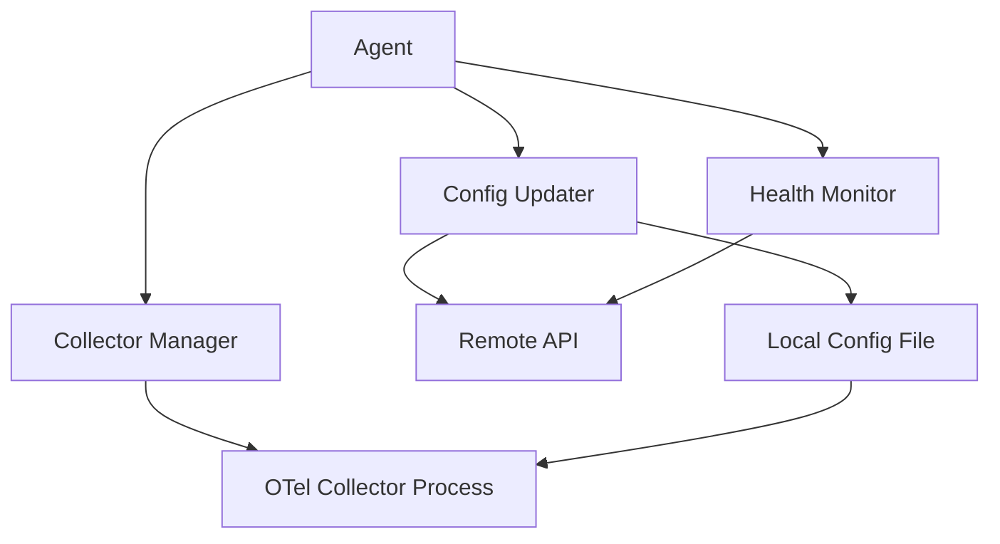

The KloudMate Agent provides robust lifecycle management for the OpenTelemetry Collector, handling startup, shutdown, configuration updates, and automatic restarts. The agent acts as a supervisor for the collector process, ensuring continuous operation and seamless configuration updates.

## Architecture Overview

The agent architecture separates concerns into distinct components:



<Note>
The agent does NOT implement the OpenTelemetry Collector itself. Instead, it manages the lifecycle of the official OpenTelemetry Collector distribution.
</Note>

## Core Components

### Agent Structure

The agent maintains state for all lifecycle operations:

```go agent.go:19-31
type Agent struct {
	cfg            *config.Config
	logger         *zap.SugaredLogger
	collector      *otelcol.Collector
	updater        *updater.ConfigUpdater
	shutdownSignal chan struct{}
	wg             sync.WaitGroup
	collectorMu    sync.Mutex
	isRunning      atomic.Bool
	collectorError string
	version        string
}
```

**Key fields:**
- `collector`: Reference to the running OpenTelemetry Collector instance
- `updater`: Handles remote configuration fetching and validation
- `shutdownSignal`: Coordinates graceful shutdown across goroutines
- `isRunning`: Atomic boolean for thread-safe state tracking
- `collectorMu`: Mutex protecting collector state during transitions

### Collector Initialization

The agent creates collector instances using factory patterns:

```go collector.go:9-12
func NewCollector(c *config.Config) (*otelcol.Collector, error) {
	collectorSettings := shared.CollectorInfoFactory(c.OtelConfigPath)
	return otelcol.NewCollector(collectorSettings)
}
```

This lightweight wrapper:
- Loads configuration from the path specified in agent config
- Creates an OpenTelemetry Collector instance with appropriate settings
- Returns errors if configuration is invalid or missing

## Lifecycle States

The agent manages the collector through several states:

<Steps>
  <Step title="Initialization">
    Agent loads configuration and prepares to start the collector
  </Step>
  
  <Step title="Running">
    Collector is actively processing telemetry data
  </Step>
  
  <Step title="Restarting">
    Agent stops the current collector instance and starts a new one with updated configuration
  </Step>
  
  <Step title="Stopping">
    Graceful shutdown initiated, collector flushes buffers and terminates
  </Step>
  
  <Step title="Stopped">
    Collector is not running, agent may still be active for monitoring
  </Step>
</Steps>

## Starting the Agent

The agent startup process initializes both the collector and configuration update checker:

```go agent.go:58-86
func (a *Agent) StartAgent(ctx context.Context) error {
	if !a.isRunning.CompareAndSwap(false, true) {
		return fmt.Errorf("agent already running")
	}

	setupComplete := false
	defer func() {
		if !setupComplete {
			a.isRunning.Store(false)
			a.logger.Warn("Agent startup failed, reset running state")
		}
	}()

	a.wg.Add(2)
	go func() {
		defer a.wg.Done()
		if err := a.manageCollectorLifecycle(ctx); err != nil {
			a.logger.Errorf("Initial collector run failed: %v", err)
		}
	}()
	go func() {
		defer a.wg.Done()
		a.runConfigUpdateChecker(ctx)
	}()
	a.logger.Info("agent start sequence initiated")
	setupComplete = true
	return nil
}
```

**Key behaviors:**
- Uses atomic compare-and-swap to prevent duplicate starts
- Launches two concurrent goroutines:
  1. **Collector lifecycle manager**: Runs the collector
  2. **Config update checker**: Polls for configuration changes
- Implements cleanup logic if startup fails
- Returns immediately after launching goroutines

## Collector Lifecycle Management

The core lifecycle management function handles collector creation, execution, and cleanup:

```go agent.go:114-162
func (a *Agent) manageCollectorLifecycle(ctx context.Context) error {
	// Check if agent is shutting down
	if !a.isRunning.Load() {
		a.logger.Info("agent shutting down, skipping collector start")
		return nil
	}

	// Create the collector instance
	collector, err := NewCollector(a.cfg)
	if err != nil {
		return fmt.Errorf("failed to create new collector instance: %w", err)
	}

	// Cleanup on exit
	defer func() {
		a.collectorMu.Lock()
		defer a.collectorMu.Unlock()
		if a.collector == collector {
			a.collector = nil
			a.logger.Debug("collector instance cleared")
		}
	}()

	// Atomically assign collector while holding lock
	a.collectorMu.Lock()
	if !a.isRunning.Load() {
		a.collectorMu.Unlock()
		a.logger.Info("agent shutdown initiated, aborting collector start")
		return nil
	}
	a.collector = collector
	a.collectorMu.Unlock()

	a.logger.Info("collector instance created, starting run loop")
	runErr := collector.Run(ctx)
	if runErr != nil {
		a.collectorError = runErr.Error()
		a.logger.Errorw("collector run loop exited with error", "error", runErr)
	} else {
		a.collectorError = ""
		a.logger.Info("collector run loop exited normally")
	}

	return runErr
}
```

**Thread-safety features:**
- Double-checks `isRunning` to handle race conditions during shutdown
- Uses mutex to protect collector reference updates
- Deferred cleanup ensures collector reference is cleared even on errors
- Stores error messages for status reporting to remote API

## Remote Configuration Updates

The agent continuously monitors a remote API for configuration changes:

### Configuration Polling

```go agent.go:194-230
func (a *Agent) runConfigUpdateChecker(ctx context.Context) {
	if a.cfg.ConfigUpdateURL == "" {
		a.logger.Debug("config update URL not configured, skipping update checks")
		return
	}
	if a.cfg.ConfigCheckInterval <= 0 {
		a.logger.Debug("config check interval not set, skipping update checks")
		return
	}
	a.logger.Infow("config update checker started",
		"updateURL", a.cfg.ConfigUpdateURL,
		"intervalSeconds", a.cfg.ConfigCheckInterval,
	)
	ticker := time.NewTicker(time.Duration(a.cfg.ConfigCheckInterval) * time.Second)
	defer ticker.Stop()

	// Trigger the very first config check immediately
	if err := a.performConfigCheck(ctx); err != nil {
		a.logger.Errorf("Periodic config check failed: %v", err)
	}

	for {
		select {
		case <-ticker.C:
			if err := a.performConfigCheck(ctx); err != nil {
				a.logger.Errorf("Periodic config check failed: %v", err)
			}
		case <-a.shutdownSignal:
			a.logger.Info("config update checker stopping")
			return
		case <-ctx.Done():
			a.logger.Info("config update checker stopping")
			return
		}
	}
}
```

**Configuration polling features:**
- Performs initial check immediately on startup
- Uses ticker for periodic checks (configurable interval)
- Respects shutdown signals for graceful termination
- Logs errors but continues polling on failures

### Configuration Check and Restart

When checking for updates, the agent sends status information to the remote API:

```go agent.go:232-289
func (a *Agent) performConfigCheck(agentCtx context.Context) error {
	ctx, cancel := context.WithTimeout(agentCtx, 10*time.Second)
	defer cancel()

	a.logger.Debug("checking for configuration updates")

	a.collectorMu.Lock()
	params := updater.UpdateCheckerParams{
		Version: a.version,
	}
	if a.collector != nil {
		params.CollectorStatus = "Running"
	} else {
		params.CollectorStatus = "Stopped"
		params.CollectorLastError = a.collectorError
	}
	a.collectorMu.Unlock()

	if a.isRunning.Load() {
		params.AgentStatus = "Running"
	} else {
		params.AgentStatus = "Stopped"
	}

	a.logger.Debugf("Checking for updates with params: %+v", params)

	restart, newConfig, err := a.updater.CheckForUpdates(ctx, params)
	if err != nil {
		return fmt.Errorf("updater.CheckForUpdates failed: %w", err)
	}
	if newConfig != nil && restart {
		if err := a.UpdateConfig(ctx, newConfig); err != nil {
			a.collectorError = err.Error()
			return fmt.Errorf("failed to update config file: %w", err)
		}
		a.logger.Info("configuration changed, restarting collector")
		if !a.isRunning.Load() {
			a.logger.Info("agent shutting down, skipping restart")
			return nil
		}

		a.stopCollectorInstance()
		a.wg.Add(1)
		go func() {
			defer a.wg.Done()
			if err := a.manageCollectorLifecycle(agentCtx); err != nil {
				a.collectorError = err.Error()
			} else {
				a.logger.Info("collector restarted successfully")
				a.collectorError = ""
			}
		}()
	} else {
		a.logger.Debug("no configuration change detected")
	}
	return nil
}
```

**Restart workflow:**
1. Gather current agent and collector status
2. Send status to remote API with version information
3. Receive response indicating if restart is required
4. If restart needed:
   - Write new configuration to file
   - Stop current collector instance
   - Launch new collector with updated config

### Remote API Integration

The updater component communicates with the KloudMate API:

```go updater.go:63-121
func (u *ConfigUpdater) CheckForUpdates(ctx context.Context, p UpdateCheckerParams) (bool, map[string]interface{}, error) {
	platform := runtime.GOOS
	if u.cfg.DockerMode {
		platform = "docker"
	}

	data := map[string]interface{}{
		"is_docker":          u.cfg.DockerMode,
		"hostname":           u.cfg.Hostname(),
		"platform":           platform,
		"architecture":       runtime.GOARCH,
		"agent_version":      p.Version,
		"collector_version":  version.GetCollectorVersion(),
		"agent_status":       p.AgentStatus,
		"collector_status":   p.CollectorStatus,
		"last_error_message": p.CollectorLastError,
	}
	jsonData, err := json.Marshal(data)
	if err != nil {
		panic(err)
	}

	reqCtx, cancel := context.WithTimeout(ctx, 20*time.Second)
	defer cancel()

	req, err := http.NewRequestWithContext(reqCtx, "POST", u.cfg.ConfigUpdateURL, bytes.NewBuffer(jsonData))
	if err != nil {
		return false, nil, fmt.Errorf("failed to create request: %w", err)
	}

	req.Header.Set("Content-Type", "application/json")
	if u.cfg.APIKey != "" {
		req.Header.Set("Authorization", u.cfg.APIKey)
	}

	resp, respErr := u.client.Do(req)
	if respErr != nil {
		return false, nil, fmt.Errorf("failed to fetch config updates: %w", respErr)
	}
	defer resp.Body.Close()

	if resp.StatusCode != http.StatusOK {
		body, _ := io.ReadAll(resp.Body)
		return false, nil, fmt.Errorf("config update API returned status %d: %s", resp.StatusCode, body)
	}

	var updateResp ConfigUpdateResponse
	if err := json.NewDecoder(resp.Body).Decode(&updateResp); err != nil {
		return false, nil, fmt.Errorf("failed to decode response: %w", err)
	}

	return updateResp.RestartRequired, updateResp.Config, nil
}
```

**API payload includes:**
- Platform information (OS, architecture)
- Agent and collector versions
- Current status of both agent and collector
- Last error message (for debugging)
- Hostname for agent identification

**API response:**
```go updater.go:38-41
type ConfigUpdateResponse struct {
	RestartRequired bool                   `json:"restart_required"`
	Config          map[string]interface{} `json:"config"`
}
```

## Configuration Application

When new configuration is received, the agent writes it atomically:

```go agent.go:177-192
func (a *Agent) UpdateConfig(_ context.Context, newConfig map[string]interface{}) error {
	configYAML, err := yaml.Marshal(newConfig)
	if err != nil {
		return fmt.Errorf("failed to marshal new config to YAML: %w", err)
	}
	tempFile := a.cfg.OtelConfigPath + ".new"
	if err := os.WriteFile(tempFile, configYAML, 0644); err != nil {
		return fmt.Errorf("failed to write new config to temporary file: %w", err)
	}
	if err := os.Rename(tempFile, a.cfg.OtelConfigPath); err != nil {
		return fmt.Errorf("failed to replace config file: %w", err)
	}
	a.logger.Infow("collector configuration updated", "configPath", a.cfg.OtelConfigPath)
	return nil
}
```

**Atomic update process:**
1. Convert new config to YAML format
2. Write to temporary file (`.new` suffix)
3. Atomically rename temporary file to actual config path
4. If rename succeeds, old config is replaced

This approach prevents corruption if the process crashes during the write operation.

## Graceful Shutdown

The agent implements comprehensive shutdown logic:

```go agent.go:88-112
func (a *Agent) Shutdown(ctx context.Context) error {
	if !a.isRunning.CompareAndSwap(true, false) {
		a.logger.Debug("shutdown called but agent is not running")
		return nil
	}
	close(a.shutdownSignal)
	a.logger.Info("stopping collector instance")
	a.stopCollectorInstance()

	waitCh := make(chan struct{})
	go func() {
		a.wg.Wait()
		close(waitCh)
	}()

	select {
	case <-waitCh:
		a.logger.Info("all agent goroutines completed")
	case <-ctx.Done():
		a.logger.Errorf("Agent shutdown timed out: %v", ctx.Err())
		return ctx.Err()
	}
	return nil
}
```

**Shutdown sequence:**
1. Set `isRunning` to false (atomic operation)
2. Close shutdown signal channel (notifies all goroutines)
3. Stop collector instance
4. Wait for all goroutines to complete or context timeout

### Collector Stop

```go agent.go:164-175
func (a *Agent) stopCollectorInstance() {
	a.collectorMu.Lock()
	collector := a.collector
	a.collector = nil
	a.collectorMu.Unlock()

	if collector != nil {
		a.logger.Info("shutting down active collector instance")
		collector.Shutdown()
		a.logger.Info("collector shutdown complete")
	}
}
```

**Safe shutdown:**
- Locks mutex before accessing collector reference
- Clears reference before calling shutdown
- Only calls shutdown if collector exists
- Prevents shutdown on already-stopped collectors

## Service Integration

The agent runs as a system service on Linux and Windows:

```go main.go:54-88
func (p *Program) Start(s service.Service) error {
	p.logger.Info("Starting service")
	p.wg.Add(1)
	go p.run()
	p.logger.Info("Service goroutine started")
	return nil
}

func (p *Program) Stop(s service.Service) error {
	p.logger.Info("Stopping service...")
	if p.cancelFunc != nil {
		p.logger.Info("Cancelling program context...")
		p.cancelFunc()
	}
	if p.kmAgent != nil {
		p.logger.Info("Shutting down KloudMate agent...")
		shutdownCtx, shutdownCancel := context.WithTimeout(context.Background(), 30*time.Second)
		defer shutdownCancel()
		if err := p.kmAgent.Shutdown(shutdownCtx); err != nil {
			p.logger.Errorf("Error during agent shutdown: %v", err)
		} else {
			p.logger.Info("KloudMate agent shut down successfully.")
		}
	}
	p.logger.Info("Waiting for program run goroutine to complete...")
	p.wg.Wait()
	p.logger.Info("Service stopped successfully.")
	return nil
}
```

**Service lifecycle:**
- Integrates with systemd (Linux), Windows Service Manager, or launchd (macOS)
- Handles OS-level start/stop signals
- Implements graceful shutdown with timeout
- Logs all lifecycle events for debugging

## Configuration

### Agent Configuration

Key configuration parameters:

```go config.go:14-26
type Config struct {
	Collector           map[string]interface{}
	AgentConfigPath     string
	OtelConfigPath      string
	ExporterEndpoint    string
	ConfigUpdateURL     string
	APIKey              string
	ConfigCheckInterval int
	DockerMode          bool
	DockerEndpoint      string
}
```

### Configuration File Paths

Default paths vary by platform:

```go config.go:54-65
func GetDefaultConfigPath() string {
	if runtime.GOOS == "windows" {
		execPath, _ := os.Executable()
		return filepath.Join(filepath.Dir(execPath), "config.yaml")
	} else if runtime.GOOS == "darwin" {
		return "/Library/Application Support/kmagent/config.yaml"
	} else {
		// Linux/Unix
		return "/etc/kmagent/config.yaml"
	}
}
```

### Environment Variables

The agent accepts configuration via environment variables:

- `KM_COLLECTOR_CONFIG`: Path to OpenTelemetry Collector config
- `KM_COLLECTOR_ENDPOINT`: OTLP exporter endpoint
- `KM_API_KEY`: Authentication key for KloudMate API
- `KM_CONFIG_CHECK_INTERVAL`: Seconds between config checks
- `KM_UPDATE_ENDPOINT`: URL for configuration update API
- `KM_DOCKER_MODE`: Enable Docker-specific behavior

## Monitoring and Health

The agent reports health status to the remote API on every config check:

<CardGroup cols={2}>
  <Card title="Agent Status" icon="heartbeat">
    Reports whether the agent process is running and responsive
  </Card>
  
  <Card title="Collector Status" icon="gauge">
    Indicates if the collector is actively processing telemetry
  </Card>
  
  <Card title="Error Tracking" icon="triangle-exclamation">
    Sends last error message to aid remote troubleshooting
  </Card>
  
  <Card title="Version Information" icon="code-branch">
    Reports agent and collector versions for compatibility tracking
  </Card>
</CardGroup>

## Best Practices

<Steps>
  <Step title="Set Appropriate Check Intervals">
    Configure `ConfigCheckInterval` based on your needs:
    - **Production**: 60-300 seconds (avoid excessive API calls)
    - **Development**: 10-30 seconds (faster iteration)
  </Step>
  
  <Step title="Monitor Agent Logs">
    Agent logs provide visibility into lifecycle events:
    - Linux: `/var/log/kmagent/`
    - Docker: `docker logs <container>`
    - Windows: Event Viewer or service logs
  </Step>
  
  <Step title="Test Configuration Changes">
    Validate new configurations before deploying via remote API to avoid restart loops
  </Step>
  
  <Step title="Handle Restart Windows">
    Plan configuration updates during maintenance windows for critical systems
  </Step>
</Steps>

<Warning>
Configuration restarts cause brief interruption in telemetry collection. Plan updates during low-traffic periods or use staged rollouts.
</Warning>

## Troubleshooting

<AccordionGroup>
  <Accordion title="Collector won't start">
    **Symptoms**: Agent starts but collector fails immediately
    
    **Check**:
    - Validate YAML syntax in collector config
    - Verify all required receivers/exporters are configured
    - Check file permissions on config file
    - Review collector logs for specific errors
  </Accordion>
  
  <Accordion title="Configuration updates not applying">
    **Symptoms**: Remote changes don't trigger restart
    
    **Check**:
    - Verify `ConfigUpdateURL` is set correctly
    - Confirm API key is valid
    - Check network connectivity to API endpoint
    - Review agent logs for update checker errors
    - Ensure `ConfigCheckInterval` is > 0
  </Accordion>
  
  <Accordion title="Restart loops">
    **Symptoms**: Collector starts and immediately crashes repeatedly
    
    **Solutions**:
    - Check collector error message in agent logs
    - Verify exporter endpoints are reachable
    - Ensure resource limits are sufficient
    - Temporarily disable remote config updates to stabilize
  </Accordion>
  
  <Accordion title="Shutdown hangs">
    **Symptoms**: Agent doesn't stop cleanly
    
    **Solutions**:
    - Check for goroutine leaks in logs
    - Verify collector shutdown timeout is reasonable
    - Force kill and review logs for deadlocks
  </Accordion>
</AccordionGroup>

## Next Steps

<CardGroup cols={2}>
  <Card title="Auto-Instrumentation" href="/features/auto-instrumentation" icon="wand-magic-sparkles">
    Learn about automatic application instrumentation
  </Card>
  
  <Card title="Synthetic Monitoring" href="/features/synthetic-monitoring" icon="stethoscope">
    Explore built-in health checks and monitoring
  </Card>
</CardGroup>