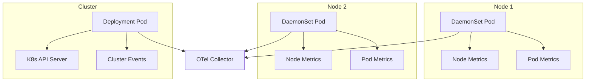

The KloudMate Agent is designed to run seamlessly across multiple platforms and deployment environments. Whether you're running on bare metal Linux servers, containerized Docker hosts, Windows machines, or Kubernetes clusters, the agent provides consistent OpenTelemetry data collection with platform-specific optimizations.

## Supported Platforms

<CardGroup cols={2}>
  <Card title="Linux" icon="linux">
    Debian/Ubuntu and RHEL/CentOS distributions
  </Card>
  
  <Card title="Docker" icon="docker">
    Containerized deployment with host metric collection
  </Card>
  
  <Card title="Kubernetes" icon="dharmachakra">
    DaemonSet and Deployment modes with auto-instrumentation
  </Card>
  
  <Card title="Windows" icon="windows">
    Windows Server 2016+ with native service integration
  </Card>
</CardGroup>

## Linux Installation

The agent supports both Debian-based and Red Hat-based Linux distributions through an automated installation script.

### Supported Distributions

**Debian/Ubuntu Family:**
- Ubuntu 18.04, 20.04, 22.04, 24.04
- Debian 9, 10, 11, 12

**Red Hat Family:**
- RHEL 7, 8, 9
- CentOS 7, 8
- Rocky Linux 8, 9
- AlmaLinux 8, 9

### Installation Command

```bash
KM_API_KEY="<YOUR_API_KEY>" \
KM_COLLECTOR_ENDPOINT="https://otel.kloudmate.com:4318" \
bash -c "$(curl -L https://cdn.kloudmate.com/scripts/install_linux.sh)"
```

### What Gets Installed

The installation script performs the following actions:

<Steps>
  <Step title="Download Agent Binary">
    Downloads the appropriate binary for your architecture (amd64/arm64)
  </Step>
  
  <Step title="Create System User">
    Creates a dedicated `kmagent` user for running the service
  </Step>
  
  <Step title="Install Service">
    Configures systemd service for automatic startup and management
  </Step>
  
  <Step title="Configure Agent">
    Writes configuration to `/etc/kmagent/config.yaml`
  </Step>
  
  <Step title="Start Service">
    Enables and starts the `kmagent` service
  </Step>
</Steps>

### Configuration Paths

```go config.go:54-65
func GetDefaultConfigPath() string {
	if runtime.GOOS == "windows" {
		execPath, _ := os.Executable()
		return filepath.Join(filepath.Dir(execPath), "config.yaml")
	} else if runtime.GOOS == "darwin" {
		return "/Library/Application Support/kmagent/config.yaml"
	} else {
		// Linux/Unix
		return "/etc/kmagent/config.yaml"
	}
}
```

**Linux paths:**
- Configuration: `/etc/kmagent/config.yaml`
- Binary: `/usr/local/bin/kmagent`
- Logs: `/var/log/kmagent/kmagent.log`
- Service: `/etc/systemd/system/kmagent.service`

### Service Management

<CodeGroup>
```bash Start Service
sudo systemctl start kmagent
```

```bash Stop Service
sudo systemctl stop kmagent
```

```bash Restart Service
sudo systemctl restart kmagent
```

```bash Check Status
sudo systemctl status kmagent
```

```bash View Logs
sudo journalctl -u kmagent -f
```

```bash Enable Auto-Start
sudo systemctl enable kmagent
```
</CodeGroup>

### Uninstallation

```bash
# Stop and disable service
sudo systemctl stop kmagent
sudo systemctl disable kmagent

# Remove files
sudo rm -f /usr/local/bin/kmagent
sudo rm -rf /etc/kmagent
sudo rm -f /etc/systemd/system/kmagent.service

# Reload systemd
sudo systemctl daemon-reload
```

## Docker Installation

The Docker agent runs as a containerized service that collects host-level metrics and logs through volume mounts.

### Installation Command

```bash
KM_API_KEY="<YOUR_API_KEY>" \
KM_COLLECTOR_ENDPOINT="https://otel.kloudmate.com:4318" \
bash -c "$(curl -L https://cdn.kloudmate.com/scripts/install_docker.sh)"
```

### Docker Mode Configuration

The agent detects Docker mode and adjusts its behavior:

```go config.go:14-26
type Config struct {
	Collector           map[string]interface{}
	AgentConfigPath     string
	OtelConfigPath      string
	ExporterEndpoint    string
	ConfigUpdateURL     string
	APIKey              string
	ConfigCheckInterval int
	DockerMode          bool          // Enables Docker-specific behavior
	DockerEndpoint      string        // Docker socket path
}
```

### Manual Docker Run

You can also run the agent manually with Docker:

```bash
docker run -d \
  --name kloudmate-agent \
  --restart unless-stopped \
  -e KM_API_KEY="<YOUR_API_KEY>" \
  -e KM_COLLECTOR_ENDPOINT="https://otel.kloudmate.com:4318" \
  -e KM_DOCKER_MODE="true" \
  -e KM_CONFIG_CHECK_INTERVAL=60 \
  -v /var/log:/var/log:ro \
  -v /proc:/host/proc:ro \
  -v /sys:/host/sys:ro \
  -v /var/run/docker.sock:/var/run/docker.sock:ro \
  ghcr.io/kloudmate/km-kube-agent:latest
```

### Volume Mounts Explained

| Mount Point | Purpose | Access |
|------------|---------|--------|
| `/var/log:/var/log:ro` | Collect system and application logs | Read-only |
| `/proc:/host/proc:ro` | CPU, memory, and process metrics | Read-only |
| `/sys:/host/sys:ro` | System device and hardware metrics | Read-only |
| `/var/run/docker.sock` | Monitor Docker containers | Read-only |

### Docker-Specific Features

- **Container Discovery**: Automatically discovers and monitors running containers
- **Docker Metrics**: Collects container CPU, memory, network, and disk I/O
- **Log Collection**: Captures container logs via volume mounts
- **Auto-Restart**: Container configured with restart policy for reliability

## Kubernetes Installation

The Kubernetes deployment uses both DaemonSet (node-level) and Deployment (cluster-level) modes for comprehensive monitoring.

### Prerequisites

<Steps>
  <Step title="Install Instrumentation CRD">
    Required for auto-instrumentation support:
    
    ```bash
    kubectl apply -f https://raw.githubusercontent.com/kloudmate/km-agent/refs/heads/develop/deployment/helm/km-kube-agent/crds/crd-otel-instrumentation.yaml
    ```
  </Step>
  
  <Step title="Add Helm Repository">
    ```bash
    helm repo add kloudmate https://kloudmate.github.io/km-agent
    helm repo update
    ```
  </Step>
</Steps>

### Installation

```bash
helm install kloudmate-release kloudmate/km-kube-agent \
  --namespace km-agent \
  --create-namespace \
  --set API_KEY="<YOUR_API_KEY>" \
  --set COLLECTOR_ENDPOINT="https://otel.kloudmate.com:4318" \
  --set clusterName="<YOUR_CLUSTER_NAME>" \
  --set "monitoredNamespaces={namespace1,namespace2}" \
  --set featuresEnabled.apm=true \
  --set featuresEnabled.logs=true
```

### Helm Configuration

Key configuration options from `values.yaml`:

```yaml values.yaml:1-18
replicaCount: 1
installCRDs: true

# KloudMate platform specific arguments
API_KEY:                           # Required: Your API key
COLLECTOR_ENDPOINT: https://otel.kloudmate.com:4318
KM_UPDATE_ENDPOINT: https://api.kloudmate.com/agents/config-check
KM_CONFIG_CHECK_INTERVAL: 30s
KM_CFG_UPDATER_RPC_ADDR: 5501

featuresEnabled:
  apm: false      # Enable auto-instrumentation
  logs: false     # Enable log collection
  metrics: true   # Enable metrics collection (default: true)
  traces: true    # Enable trace collection (default: true)

clusterName: km-cluster
monitoredNamespaces: []  # Namespaces to instrument
```

### Kubernetes Architecture

The Kubernetes agent runs in two modes:



**DaemonSet (Node-Level):**
- Runs one pod per node
- Collects node CPU, memory, disk, network metrics
- Monitors pods running on the node
- Gathers container logs

**Deployment (Cluster-Level):**
- Single replica for cluster-wide monitoring
- Collects Kubernetes events
- Monitors cluster resources (namespaces, services, deployments)
- Handles auto-instrumentation coordination

### Tolerations for Tainted Nodes

If your cluster uses node taints, configure tolerations:

```bash
helm install kloudmate-release kloudmate/km-kube-agent \
  --namespace km-agent \
  --create-namespace \
  --set API_KEY="<YOUR_API_KEY>" \
  --set COLLECTOR_ENDPOINT="https://otel.kloudmate.com:4318" \
  --set clusterName="production" \
  --set tolerations[0].key="env" \
  --set tolerations[0].operator="Equal" \
  --set tolerations[0].value="production" \
  --set tolerations[0].effect="NoSchedule"
```

### Node Affinity

From `values.yaml`, default node affinity prefers:

```yaml values.yaml:56-78
nodeAffinity:
  preferredDuringSchedulingIgnoredDuringExecution:
  - weight: 100
    preference:
      matchExpressions:
      - key: kubernetes.io/os
        operator: In
        values:
        - linux
  - weight: 80
    preference:
      matchExpressions:
      - key: node.kubernetes.io/instance-type
        operator: NotIn
        values:
        - spot
  - weight: 60
    preference:
      matchExpressions:
      - key: topology.kubernetes.io/zone
        operator: Exists
```

**Affinity rules:**
- Prefers Linux nodes (weight: 100)
- Avoids spot instances (weight: 80)
- Prefers nodes in availability zones (weight: 60)

### GKE Private Cluster Requirements

<Warning>
For private GKE clusters, you must allow master nodes to access port 9443/tcp on worker nodes for webhook communication.
</Warning>

```bash
# Allow webhook traffic
gcloud compute firewall-rules create allow-webhook \
  --allow tcp:9443 \
  --source-ranges=<MASTER_CIDR> \
  --target-tags=<NODE_TAG> \
  --description="Allow OpenTelemetry operator webhooks"
```

See [GKE documentation](https://cloud.google.com/kubernetes-engine/docs/how-to/private-clusters#add_firewall_rules) for details.

## Windows Installation

The agent runs as a Windows service on Windows Server 2016 and later.

### Download and Install

1. Download the Windows installer from the [releases page](https://github.com/kloudmate/km-agent/releases)
2. Run the `.exe` installer with administrator privileges
3. Follow the installation wizard
4. Configure API key and collector endpoint when prompted

### Configuration

Windows configuration path:

```go config.go:56-58
if runtime.GOOS == "windows" {
	execPath, _ := os.Executable()
	return filepath.Join(filepath.Dir(execPath), "config.yaml")
}
```

**Windows paths:**
- Configuration: `C:\Program Files\KloudMate\kmagent\config.yaml`
- Binary: `C:\Program Files\KloudMate\kmagent\kmagent.exe`
- Logs: Windows Event Viewer or `C:\ProgramData\KloudMate\logs\`

### Service Management

<CodeGroup>
```powershell Start Service
Start-Service -Name "kmagent"
```

```powershell Stop Service
Stop-Service -Name "kmagent"
```

```powershell Restart Service
Restart-Service -Name "kmagent"
```

```powershell Check Status
Get-Service -Name "kmagent"
```

```powershell View Logs
Get-EventLog -LogName Application -Source "kmagent" -Newest 50
```
</CodeGroup>

### Service Integration

The agent uses the [kardianos/service](https://github.com/kardianos/service) library for cross-platform service management:

```go main.go:121-133
func makeService(p *Program) (service.Service, error) {
	svcConfig := &service.Config{
		Name:        "kmagent",
		DisplayName: "KloudMate Agent",
		Description: "KloudMate Agent for OpenTelemetry auto instrumentation",
	}
	svc, err := service.New(p, svcConfig)
	if err != nil {
		return nil, fmt.Errorf("error creating service: %w", err)
	}
	return svc, nil
}
```

This provides consistent service behavior across Windows, Linux, and macOS.

## Platform Detection

The agent automatically detects the running platform:

```go updater.go:66-69
platform := runtime.GOOS
if u.cfg.DockerMode {
	platform = "docker"
}
```

**Platform identifiers:**
- `linux`: Native Linux installation
- `windows`: Native Windows installation
- `darwin`: macOS (limited support)
- `docker`: Docker containerized mode

## Environment-Specific Features

### Linux-Specific
- Systemd integration
- Journald log collection
- Host metric collection via `/proc` and `/sys`
- Package manager integration (apt/yum)

### Docker-Specific
- Container discovery and monitoring
- Docker socket access for metrics
- Volume-mounted log collection
- Container lifecycle tracking

### Kubernetes-Specific
- Auto-instrumentation via OpenTelemetry Operator
- DaemonSet for node-level metrics
- Deployment for cluster-level monitoring
- Service discovery
- Resource attributes from K8s API

### Windows-Specific
- Windows Event Log integration
- Performance counter collection
- Windows Service Manager integration
- IIS monitoring (if enabled)

## Configuration File Differences

While the agent configuration is mostly platform-agnostic, some paths differ:

<CodeGroup>
```yaml Linux (/etc/kmagent/config.yaml)
OtelConfigPath: /etc/kmagent/otel-config.yaml
ConfigCheckInterval: 60
ExporterEndpoint: https://otel.kloudmate.com:4318
APIKey: your-api-key
```

```yaml Docker (Environment Variables)
KM_DOCKER_MODE: true
KM_COLLECTOR_CONFIG: /etc/kmagent/otel-config.yaml
KM_CONFIG_CHECK_INTERVAL: 60
KM_COLLECTOR_ENDPOINT: https://otel.kloudmate.com:4318
KM_API_KEY: your-api-key
```

```yaml Kubernetes (ConfigMap)
apiVersion: v1
kind: ConfigMap
metadata:
  name: km-agent-configmap-daemonset
  namespace: km-agent
data:
  config.yaml: |
    # OpenTelemetry Collector configuration
    receivers:
      hostmetrics:
        collection_interval: 30s
    exporters:
      otlp:
        endpoint: ${COLLECTOR_ENDPOINT}
```

```yaml Windows (C:\Program Files\KloudMate\kmagent\config.yaml)
OtelConfigPath: C:\Program Files\KloudMate\kmagent\otel-config.yaml
ConfigCheckInterval: 60
ExporterEndpoint: https://otel.kloudmate.com:4318
APIKey: your-api-key
```
</CodeGroup>

## Cross-Platform Command Reference

| Operation | Linux | Docker | Kubernetes | Windows |
|-----------|-------|--------|------------|--------|
| Start | `systemctl start kmagent` | `docker start kloudmate-agent` | `helm install ...` | `Start-Service kmagent` |
| Stop | `systemctl stop kmagent` | `docker stop kloudmate-agent` | `helm uninstall ...` | `Stop-Service kmagent` |
| Status | `systemctl status kmagent` | `docker ps -f name=kloudmate` | `kubectl get pods -n km-agent` | `Get-Service kmagent` |
| Logs | `journalctl -u kmagent -f` | `docker logs -f kloudmate-agent` | `kubectl logs -n km-agent -l app=km-agent` | `Get-EventLog -Source kmagent` |
| Config | `/etc/kmagent/config.yaml` | Environment variables | ConfigMap | `C:\Program Files\KloudMate\...` |

## Best Practices

<CardGroup cols={2}>
  <Card title="Use Platform-Native Tools" icon="wrench">
    Leverage systemd on Linux, Docker Compose for containers, Helm for Kubernetes, and Services on Windows
  </Card>
  
  <Card title="Consistent Configuration" icon="clone">
    Use configuration management tools (Ansible, Terraform) to maintain consistent settings across platforms
  </Card>
  
  <Card title="Centralized Monitoring" icon="chart-mixed">
    View all agents in the KloudMate dashboard regardless of platform
  </Card>
  
  <Card title="Platform-Specific Optimization" icon="gauge-high">
    Configure receivers based on platform capabilities (e.g., Windows Performance Counters, Docker stats)
  </Card>
</CardGroup>

## Troubleshooting by Platform

<AccordionGroup>
  <Accordion title="Linux: Service won't start">
    **Check**:
    - SELinux/AppArmor restrictions: `sudo journalctl -xe`
    - File permissions: `ls -la /etc/kmagent/`
    - Binary permissions: `ls -la /usr/local/bin/kmagent`
    - Port conflicts: `sudo netstat -tulpn | grep 4318`
  </Accordion>
  
  <Accordion title="Docker: Container exits immediately">
    **Check**:
    - Container logs: `docker logs kloudmate-agent`
    - Volume mount permissions
    - API key environment variable: `docker inspect kloudmate-agent | grep KM_API_KEY`
    - Network connectivity to collector endpoint
  </Accordion>
  
  <Accordion title="Kubernetes: Pods not scheduling">
    **Check**:
    - Pod events: `kubectl describe pod -n km-agent`
    - Node taints and tolerations
    - Resource limits and node capacity
    - Image pull errors: `kubectl get events -n km-agent`
  </Accordion>
  
  <Accordion title="Windows: Service fails to start">
    **Check**:
    - Event Viewer logs (Application log)
    - User permissions (must run as Administrator)
    - Firewall rules for outbound HTTPS
    - Config file syntax: `type "C:\Program Files\KloudMate\kmagent\config.yaml"`
  </Accordion>
</AccordionGroup>

## Next Steps

<CardGroup cols={2}>
  <Card title="Agent Configuration" href="/configuration/agent-config" icon="gear">
    Learn about agent configuration options
  </Card>
  
  <Card title="Collector Configuration" href="/configuration/collector-config" icon="sliders">
    Configure the OpenTelemetry Collector
  </Card>
</CardGroup>