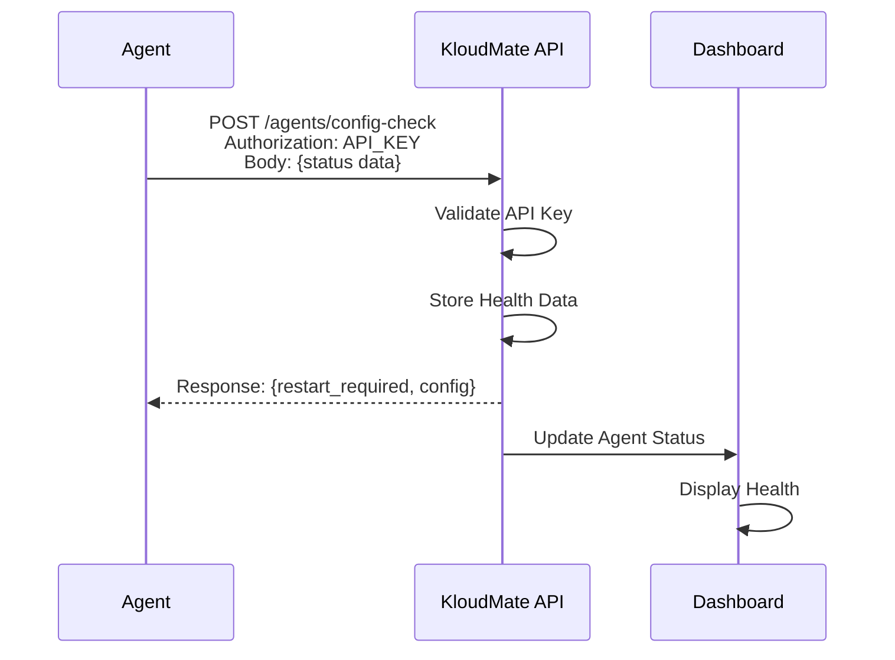

The KloudMate Agent includes comprehensive synthetic monitoring capabilities that provide visibility into agent health, collector status, and operational metrics. The agent actively reports its state to the KloudMate platform, enabling centralized monitoring and alerting without additional infrastructure.

## Overview

Synthetic monitoring in the KloudMate Agent encompasses:

<CardGroup cols={2}>
  <Card title="Health Reporting" icon="heart-pulse">
    Continuous status updates to the KloudMate platform
  </Card>
  
  <Card title="Error Tracking" icon="bug">
    Automatic capture and transmission of error states
  </Card>
  
  <Card title="Version Monitoring" icon="tag">
    Track agent and collector versions across your infrastructure
  </Card>
  
  <Card title="Platform Identification" icon="fingerprint">
    Unique agent identification for multi-environment management
  </Card>
</CardGroup>

## Health Check Mechanism

The agent performs health checks as part of its configuration update cycle, sending detailed status information to the KloudMate API.

### Status Reporting Payload

Every configuration check includes comprehensive health data:

```go updater.go:64-81
data := map[string]interface{}{
	"is_docker":          u.cfg.DockerMode,
	"hostname":           u.cfg.Hostname(),
	"platform":           platform,
	"architecture":       runtime.GOARCH,
	"agent_version":      p.Version,
	"collector_version":  version.GetCollectorVersion(),
	"agent_status":       p.AgentStatus,
	"collector_status":   p.CollectorStatus,
	"last_error_message": p.CollectorLastError,
}
```

**Reported metrics:**

| Field | Description | Example Values |
|-------|-------------|----------------|
| `is_docker` | Whether running in Docker mode | `true`, `false` |
| `hostname` | System hostname for identification | `web-server-01` |
| `platform` | Operating system | `linux`, `windows`, `darwin`, `docker` |
| `architecture` | CPU architecture | `amd64`, `arm64` |
| `agent_version` | Current agent version | `0.1.0` |
| `collector_version` | OpenTelemetry Collector version | `0.115.0` |
| `agent_status` | Agent process state | `Running`, `Stopped` |
| `collector_status` | Collector process state | `Running`, `Stopped` |
| `last_error_message` | Last error encountered | Error string or empty |

### Status Collection

The agent gathers status information before each API call:

```go agent.go:232-257
func (a *Agent) performConfigCheck(agentCtx context.Context) error {
	ctx, cancel := context.WithTimeout(agentCtx, 10*time.Second)
	defer cancel()

	a.logger.Debug("checking for configuration updates")

	// Safely read collector status under lock
	a.collectorMu.Lock()
	params := updater.UpdateCheckerParams{
		Version: a.version,
	}
	if a.collector != nil {
		params.CollectorStatus = "Running"
	} else {
		params.CollectorStatus = "Stopped"
		params.CollectorLastError = a.collectorError
	}
	a.collectorMu.Unlock()

	if a.isRunning.Load() {
		params.AgentStatus = "Running"
	} else {
		params.AgentStatus = "Stopped"
	}

	a.logger.Debugf("Checking for updates with params: %+v", params)
}
```

**Thread-safe status gathering:**
- Uses mutex lock when checking collector reference
- Reads atomic boolean for agent running state
- Captures last error message for diagnostics

## API Communication

The agent communicates with the KloudMate platform via HTTPS POST requests:

```go updater.go:90-106
req, err := http.NewRequestWithContext(reqCtx, "POST", u.cfg.ConfigUpdateURL, bytes.NewBuffer(jsonData))
if err != nil {
	return false, nil, fmt.Errorf("failed to create request: %w", err)
}

req.Header.Set("Content-Type", "application/json")
if u.cfg.APIKey != "" {
	req.Header.Set("Authorization", u.cfg.APIKey)
}

resp, respErr := u.client.Do(req)
if respErr != nil {
	return false, nil, fmt.Errorf("failed to fetch config updates: %w", respErr)
}
defer resp.Body.Close()
```

**Security features:**
- HTTPS for encrypted communication
- API key authentication in Authorization header
- Request timeout protection (20 seconds)
- Context-aware cancellation

### API Endpoint Configuration

The update endpoint is automatically derived from the collector endpoint:

```go config.go:28-52
func GetAgentConfigUpdaterURL(collectorEndpoint string) string {
	const fallbackURL = "https://api.kloudmate.com/agents/config-check"

	u, _ := url.Parse(collectorEndpoint)
	host := u.Hostname()
	parts := strings.Split(host, ".")

	if len(parts) < 2 {
		return fallbackURL
	}

	// Extract root domain from collector endpoint
	// e.g., "otel.kloudmate.dev" -> "kloudmate.dev"
	rootDomain := parts[len(parts)-2] + "." + parts[len(parts)-1]

	// Build API URL with same domain
	updateURL := url.URL{
		Scheme: u.Scheme,
		Host:   "api." + rootDomain,
		Path:   "/agents/config-check",
	}

	return updateURL.String()
}
```

**Endpoint derivation examples:**

| Collector Endpoint | Derived API Endpoint |
|-------------------|---------------------|
| `https://otel.kloudmate.com:4318` | `https://api.kloudmate.com/agents/config-check` |
| `https://otel.kloudmate.dev:4318` | `https://api.kloudmate.dev/agents/config-check` |
| `https://otel.example.io:4318` | `https://api.example.io/agents/config-check` |

This allows seamless operation across different KloudMate environments (production, staging, on-premise).

## Health Check Frequency

Health checks occur at configurable intervals:

### Configuration

```go agent.go:194-230
func (a *Agent) runConfigUpdateChecker(ctx context.Context) {
	if a.cfg.ConfigUpdateURL == "" {
		a.logger.Debug("config update URL not configured, skipping update checks")
		return
	}
	if a.cfg.ConfigCheckInterval <= 0 {
		a.logger.Debug("config check interval not set, skipping update checks")
		return
	}
	a.logger.Infow("config update checker started",
		"updateURL", a.cfg.ConfigUpdateURL,
		"intervalSeconds", a.cfg.ConfigCheckInterval,
	)
	ticker := time.NewTicker(time.Duration(a.cfg.ConfigCheckInterval) * time.Second)
	defer ticker.Stop()

	// Perform first check immediately
	if err := a.performConfigCheck(ctx); err != nil {
		a.logger.Errorf("Periodic config check failed: %v", err)
	}

	for {
		select {
		case <-ticker.C:
			if err := a.performConfigCheck(ctx); err != nil {
				a.logger.Errorf("Periodic config check failed: %v", err)
			}
		case <-a.shutdownSignal:
			a.logger.Info("config update checker stopping")
			return
		case <-ctx.Done():
			a.logger.Info("config update checker stopping")
			return
		}
	}
}
```

**Check interval behavior:**
- Default interval: 60 seconds
- First check: Immediate on agent startup
- Subsequent checks: On ticker interval
- Error handling: Logs errors but continues checking
- Graceful shutdown: Stops on context cancellation or shutdown signal

### Configuring Check Interval

<CodeGroup>
```bash Linux/Docker (Environment Variable)
export KM_CONFIG_CHECK_INTERVAL=30
```

```yaml Helm (Kubernetes)
KM_CONFIG_CHECK_INTERVAL: "30s"
```

```bash CLI Flag
kmagent start --config-check-interval 30
```

```yaml Config File
ConfigCheckInterval: 30
```
</CodeGroup>

<Note>
Recommended intervals:
- **Production**: 60-300 seconds
- **Staging**: 30-60 seconds
- **Development**: 10-30 seconds
</Note>

## Error Tracking and Reporting

The agent captures and reports errors from the collector:

### Error Capture

```go agent.go:151-159
runErr := collector.Run(ctx)
if runErr != nil {
	a.collectorError = runErr.Error()
	a.logger.Errorw("collector run loop exited with error", "error", runErr)
} else {
	a.collectorError = ""
	a.logger.Info("collector run loop exited normally")
}
```

Errors are stored in the `collectorError` field and included in the next health check report.

### Error Persistence

Errors remain in the status until the collector successfully starts:

```go agent.go:240-248
a.collectorMu.Lock()
params := updater.UpdateCheckerParams{
	Version: a.version,
}
if a.collector != nil {
	params.CollectorStatus = "Running"
} else {
	params.CollectorStatus = "Stopped"
	params.CollectorLastError = a.collectorError  // Reported to API
}
a.collectorMu.Unlock()
```

This ensures the KloudMate platform receives error information even if the agent itself is healthy.

## Unique Agent Identification

Each agent is uniquely identifiable through multiple attributes:

### Identification Components

<Steps>
  <Step title="Hostname">
    System hostname provides human-readable identification:
    
    ```go config.go:119-125
    func (c *Config) Hostname() string {
        n, e := os.Hostname()
        if e != nil {
            n = ""
        }
        return n
    }
    ```
  </Step>
  
  <Step title="Platform Information">
    Operating system and architecture help categorize agents:
    - Platform: `linux`, `windows`, `darwin`, `docker`
    - Architecture: `amd64`, `arm64`, `386`
  </Step>
  
  <Step title="Deployment Context">
    Additional metadata for Kubernetes deployments:
    - Cluster name (configured via Helm)
    - Namespace
    - Pod name
    - Node name
  </Step>
</Steps>

### Kubernetes-Specific Monitoring

For Kubernetes deployments, additional monitoring data is available through:

- **DaemonSet agents**: Report node-level metrics
- **Deployment agents**: Report cluster-level metrics
- **Service discovery**: Automatic endpoint detection

## Dashboard Integration

The KloudMate platform uses health data to provide:

<CardGroup cols={2}>
  <Card title="Agent Inventory" icon="list">
    Complete list of all agents with status, version, and platform
  </Card>
  
  <Card title="Health Dashboard" icon="chart-line">
    Real-time view of agent and collector health across your infrastructure
  </Card>
  
  <Card title="Alert Configuration" icon="bell">
    Set up alerts for agent failures, version mismatches, or error conditions
  </Card>
  
  <Card title="Trend Analysis" icon="chart-area">
    Historical view of agent uptime and error patterns
  </Card>
</CardGroup>

## Configuration Examples

### Linux Installation with Custom Monitoring

```bash
KM_API_KEY="your-api-key" \
KM_COLLECTOR_ENDPOINT="https://otel.kloudmate.com:4318" \
KM_CONFIG_CHECK_INTERVAL=30 \
bash -c "$(curl -L https://cdn.kloudmate.com/scripts/install_linux.sh)"
```

### Docker with Health Reporting

```bash
docker run -d \
  --name kloudmate-agent \
  -e KM_API_KEY="your-api-key" \
  -e KM_COLLECTOR_ENDPOINT="https://otel.kloudmate.com:4318" \
  -e KM_CONFIG_CHECK_INTERVAL=60 \
  -v /var/log:/var/log:ro \
  -v /proc:/host/proc:ro \
  ghcr.io/kloudmate/km-kube-agent:latest
```

### Kubernetes with Enhanced Monitoring

```yaml
helm install kloudmate-release kloudmate/km-kube-agent \
  --namespace km-agent \
  --create-namespace \
  --set API_KEY="your-api-key" \
  --set COLLECTOR_ENDPOINT="https://otel.kloudmate.com:4318" \
  --set KM_CONFIG_CHECK_INTERVAL="30s" \
  --set clusterName="production-cluster"
```

## Monitoring Best Practices

<Steps>
  <Step title="Set Appropriate Intervals">
    Balance between monitoring responsiveness and API load:
    - High-value production systems: 30-60 seconds
    - Standard deployments: 60-120 seconds
    - Large fleets (100+ agents): 120-300 seconds
  </Step>
  
  <Step title="Monitor Agent Logs">
    Enable debug logging temporarily for troubleshooting:
    ```bash
    # Linux/Docker
    tail -f /var/log/kmagent/kmagent.log | grep -i error
    
    # Kubernetes
    kubectl logs -n km-agent daemonset/km-agent --tail=50 -f
    ```
  </Step>
  
  <Step title="Set Up Alerts">
    Configure alerts in the KloudMate dashboard for:
    - Agent offline (no heartbeat for 2x check interval)
    - Collector stopped
    - Repeated errors
    - Version drift across agents
  </Step>
  
  <Step title="Regular Health Checks">
    Review agent health dashboard weekly to identify:
    - Agents with persistent errors
    - Version inconsistencies
    - Unusual restart patterns
  </Step>
</Steps>

## Troubleshooting

<AccordionGroup>
  <Accordion title="No health data in dashboard">
    **Symptoms**: Agent appears to be running but not reporting to platform
    
    **Check**:
    - Verify API key is correct: `echo $KM_API_KEY`
    - Confirm update URL is reachable:
      ```bash
      curl -X POST https://api.kloudmate.com/agents/config-check \
        -H "Authorization: your-api-key" \
        -H "Content-Type: application/json" \
        -d '{}'
      ```
    - Check agent logs for connection errors
    - Verify firewall rules allow outbound HTTPS
  </Accordion>
  
  <Accordion title="Stale health data">
    **Symptoms**: Last seen timestamp is outdated
    
    **Solutions**:
    - Check if agent is still running:
      ```bash
      # Linux
      systemctl status kmagent
      
      # Docker
      docker ps | grep kloudmate
      
      # Kubernetes
      kubectl get pods -n km-agent
      ```
    - Verify `ConfigCheckInterval` is set correctly
    - Review logs for repeated API failures
    - Check network connectivity
  </Accordion>
  
  <Accordion title="Incorrect agent status">
    **Symptoms**: Dashboard shows wrong status
    
    **Solutions**:
    - Wait for next check interval to see updated status
    - Manually trigger config check (restart agent)
    - Verify agent and collector processes are running
    - Check for clock skew on the host
  </Accordion>
  
  <Accordion title="High API call volume">
    **Symptoms**: Too many requests to update endpoint
    
    **Solutions**:
    - Increase `ConfigCheckInterval` to reduce frequency
    - Verify only one agent instance is running per host
    - Check for restart loops causing repeated checks
  </Accordion>
</AccordionGroup>

## Security Considerations

<Warning>
The API key grants access to your KloudMate account. Protect it appropriately:
- Use secrets management for Kubernetes (e.g., Sealed Secrets, External Secrets)
- Restrict file permissions on Linux: `chmod 600 /etc/kmagent/config.yaml`
- Rotate API keys periodically
- Use separate API keys for different environments
</Warning>

### Authentication Flow



## Metrics and Observability

The agent reports several categories of observability data:

### System Metrics
- Agent uptime
- Configuration check success rate
- Last successful check timestamp
- API response times

### Collector Metrics
- Collector uptime
- Restart count
- Error frequency
- Configuration reload success rate

### Platform Metrics
- Agent distribution by platform
- Version distribution
- Geographic distribution (based on API endpoint)

## Next Steps

<CardGroup cols={2}>
  <Card title="Multi-Platform Support" href="/features/multi-platform-support" icon="server">
    Learn about agent deployment across different environments
  </Card>
  
  <Card title="Configuration" href="/configuration/agent-config" icon="gear">
    Deep dive into agent configuration options
  </Card>
</CardGroup>